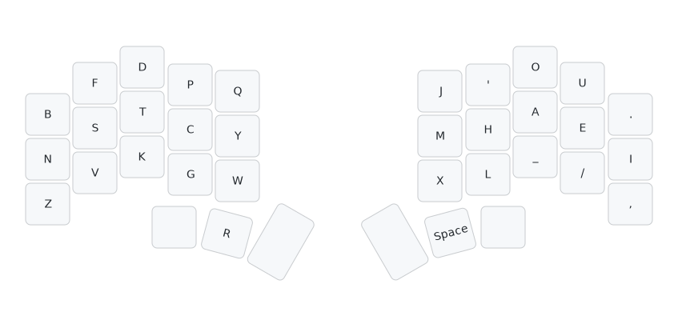
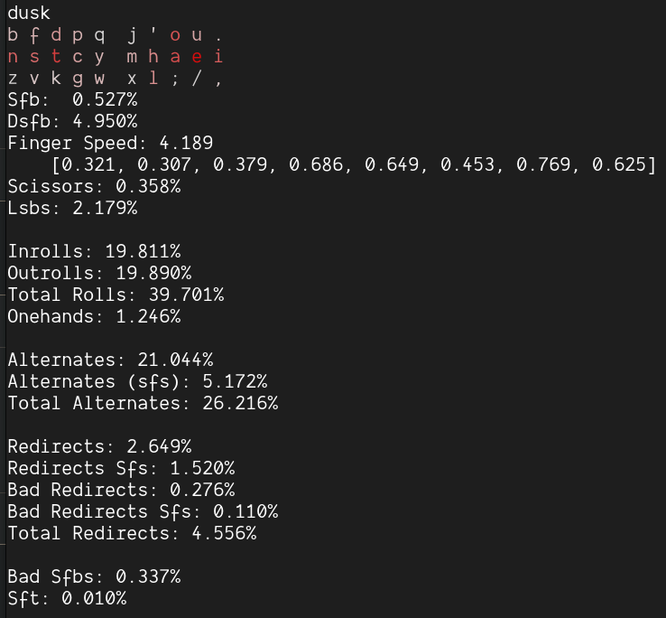
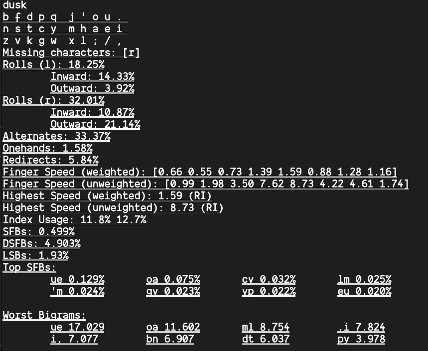
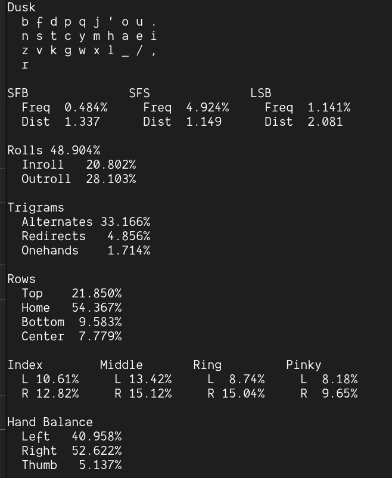
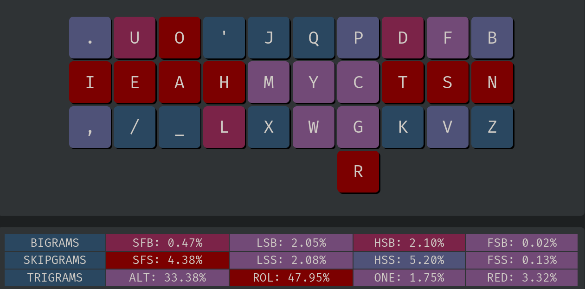
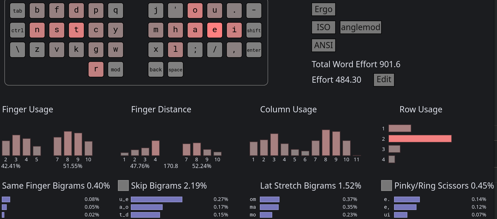
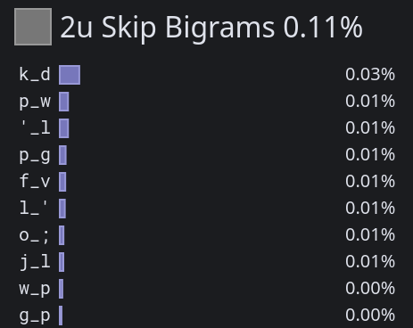

# Dusk Keyboard Layout

## Introduction
`Dusk` is a well-balanced keyboard layout for columnar keyboard with thumb keys. 

This layout is designed by me who have used [Canary (ortho)](https://github.com/Apsu/Canary) for 14 months and reached about 140 wpm on MonkeyType. As such, `Dusk` aims to do what Canary excels at and improves on its weak points.

## Layout


```
b f d p q  j ' o u .
n s t c y  m h a e i
z v k g w  x l _ / ,
        r   
```
## Motivation
Canary is a decent layout. I really like its low scissors, low 2u same-finger skipgrams (SFS), and its flowy feeling, but Canary isn't without its problems. In particular, after reaching 140 WPM, I realized that its high SFS really start to bother me and I wish my left index isn't moving as much.

I've also come to dislike `sy` and `rl` same-finger bigrams (SFBS) on Canary and would really like to avoid them, but I quickly realized that no layout really meets the criteria that I have set.

Additionally, my keyboard `Piantor Pro` is a split columnar keyboard with an aggressive pinky stagger and 3 thumb keys on each side, and most popular keyboard layouts were designed for conventional rowstag keyboards.

Seeing no good option, I decided to make my own keyboard layout.

## Design
`Dusk` was designed with these goals in mind:
- Roll over Alteration
- Low scissors
- Low 2u SFS
- Low SFS
- Low SFBS
- Low finger speed
- Low usage for pinky and ring bottom keys
- No finger gets overworked

### Vowel Block
I decided to go with the popular vowel block
```
o u
a e i
```
as it as commonly agreed upon to be the most balanced vowel block choice.
Having `I` alone on the pinky for the `.I,` stack.

Why vowel block? because vowels don't go well with most letters, but they go relatively well with each other.

### Consonants

#### `LHM`
To avoid `RL` SFBS, I decided to put `R` on a thumb key (as opposed to the `RN` stack as seen in `Kuntum`). `L` doesn't really go well with any other letter except for `H` and `M`, but `L_M` and `M_L` are both somewhat common, which leads to `LHM` stack having high 2u SFS if its on a non-index column, so `LHM` goes to index with `M` taking the inner spot, just like in Canary. If you are more bothered by LSB than 2u SFS, it would be wise to move `M` to the top.
#### `FSV`
`S` doesn't have good letters to partner with either, so I decided on `FSV` stack and feel it is appropriate for it to be on ring finger.
#### `DTK`
`T` index commonly leads to high SFS in my experience playing around with layouts for the past few months and so `DTK` stack is good for the middle finger to handle.
#### `BNZ`
`N` doesn't interact with `B` much and with a low-usage key `Z`, `BNZ` goes to pinky.
#### `PCGWYQ`
`Y` is yet another problematic letter as it creates `CY`, `PY`, `GY` SFBS and `W_Y` is common enough that I'd like `WY` to be 1u apart. 
I decided on
```
P Q
C Y
G W  
```
because:
- I want `NG` to be a nice roll and a good `G_T` (`-ing`, `-ght`, `get`, `got`).
- `C` is usually more common, so it is on the homerow.
- `Y` is there for the ease of alting `CY`, `PY`, `YP` and (optionally) `GY`.
- `W` is under `Y` because `W_Y` is common and `YW` SFBS is not that frequent. It is not above `Y` because `W_T`, `W__T`, `W__K`, and `WR` all feel awful. I am okay with `P_W` or `W_P` 2.5u SFS as they are rare. On top of that, inner lower corner is more easily reachable for my left index.
- `P` taking the last good spot and creating `PY` and `YP` alts.
#### The Quote Symbol `'`
Commonly other people have `OA'` stack on the middle finger, but after using other layouts that have this stack, I've come to dislike it. Here is why:
- The word `You're` feels like 2u SFBS even if it is 2u SFS. For me, `ou` is a roll, so my middle finger tends to not leave for `'` until after `u` has been typed.
- The words `don't` and `won't` feel just awful with how common they are.
- Additionally, `a_'` is common too (`that's`, `can't`, `what's`).

For the aforemetioned reasons, I decided to go with
```
J '
M H
X L
```
with the intention to alt `'m` and `'ll`, both of which are doable for my columnar keyboard.  If you do not want to do `'ll` alt, I think it is still preferable over `OA'` stack. (I do not believe `'ll` alt is feasible on rowstag keyboard).

It does create `h_'` SFS, but it is about as common as `a_'`.

### Stats

#### Oxeylyzer
No thumb key support


#### Keygen
No thumb key support


#### Kryllizer


#### Keysolve


#### Cyanophage


#### 2U SFS


#### Finger Usage
```
dusk (usage)
  b f d p q  j ' o u .
  n s t c y  m h a e i
  z v k g w  x l _ / ,
          r                 

MONKEYRACER:
  LI: 10.21%    RI: 13.35%
  LM: 12.02%    RM: 15.25%
  LR:  8.05%    RR: 16.58%
  LP:  8.53%    RP:  9.58%

  LT: 6.44%

  Total: 100.00%
```
#### SFS Finger Distribution
```
dusk (sfs)
  b f d p q  j ' o u .
  n s t c y  m h a e i
  z v k g w  x l _ / ,
          r                 

MONKEYRACER:
  LI:  0.63%    RI:  0.98%
  LM:  0.45%    RM:  0.54%
  LR:  0.25%    RR:  0.64%
  LP:  0.13%    RP:  0.37%

  LT: 0.00%
```
#### SFBS Finger Distribution
```
dusk (sfb)
  b f d p q  j ' o u .
  n s t c y  m h a e i
  z v k g w  x l _ / ,
          r                 

MONKEYRACER:
  LI:  0.09%    RI:  0.16%
  LM:  0.01%    RM:  0.07%
  LR:  0.02%    RR:  0.13%
  LP:  0.01%    RP:  0.00%
```

### My Thoughts
I have been using `Dusk` and I can honestly recommend it to all the thumb layout users IF you are okay with `W` position and some LSB.

Nothing bad really stands out to me except the occassional `w_p` or `p_w`. I haven't felt many scissors and 2u SFS, and SFBS and SFS are quite rare coming from `Canary-ortho`.

Having common shortcuts: CTRL-C, CTRL-V, CTRL-Z, CTRL-W, CTRL-D on one hand feel pretty good as well.

I went on to compare `Canary-ortho` with `Dusk` and list the finding below:

Comparing `Dusk` with `Canary-ortho`:
for scissors (according to Keysolve):
- 1.27% less HSB at 2.10%
- 1.13% less HSS at 5.20%
- 0.08% less FSB at 0.02%
- 0.45% less FSS at 0.13%

for 2u SFS (according to Cyanophage):
- 0.04% less 2u SFS at 0.11%

for finger speed and LSB (according to oxeylyzer):
- 1.882 less finger speed at 4.189 
- 0.354 less LSB at 2.179%

for SFS and SFBS (according to cmini on monkeyracer corpus):
- 0.58% less SFBS at 0.38%
- 3.86% less SFS at 3.86%

Overall, I believe `Dusk` is an improvement over `Canary-ortho` in a lot of ways and I am happy with how it turns out.


### FAQ
#### Why not swap 2 index block?
- It leads to a much higher alteration (32.XX%) on cmini with Monkeyracer corpus, which is too high for my taste.
- `OW` and `WO` would suck. I consider that scissors. Swapping `W` and `Q` won't help because then `WA` would suck.
- The intended `CY`, `YC`, `PY`, `YP` alts would be less feasible. Think words like `happy` or `privacy`.

#### Why not swap `X` and `Z` for lower SFBS and SFS?
- `F_X` is a skip full pinky-ring scissor (`fix`).
- `B_X` is a 2u pinky SFS (`unboxing`).
- `XP` is a bit awkward (`expect`).
- At the end of the day, stats isn't everything. Comfort should come first.

#### What's that `_`?
It is an actual underscore `_`. You can replace it with `;` if you'd like. I have it as `_` because I code in `C++` and `Rust`.

#### How much worse is vowel thumb space? / Use thumb R with vowel thumb?
It is commonly known that space should be pressed with the consonant thumb because it has lower redirection and higher roll, and so why is the thumb `R` in `Dusk` on the consonant side?

The reason is simple - thanks to `a200` analyzer, I've come to the conclusion that even after considering the extra 0.52% redirection incurred by vowel space thumb, having `R` on the consonant thumb as opposed to the vowel thumb leads to approximately 3.87% lower redirection overall.

But then you may wonder: Is the redirection caused by thumb even real? How come that I have not felt any space redirection?

For me at least, after having tried `Dusk` with vowel thumb `R` for a few days, most redirection involving `R` is just as good, if not better than, the redirection involving index finger, but with one exception: when index `L` is also involved. Take the word `earlier` for example, that word just feels bad to type with vowel thumb `R`.

#### What is The True SFBS if I alt and slide?
If you 
- Alt `PY`, `YP`, `CY`, `'M`, and `'L`. 
- Slide `UE`, `OA`, `HL`, `YW`, and `FS`.

then SFBS is almost none, leaving really only `GY`, `LM`, `I.`, and `I,`. None of which is common (unless you type `almost` a lot).

#### I despise alting, could I re-arrange index letters?
Yes - arrange them how you like them!

#### Swapping `Q`, `J`, and `X`?
- I prefer having `J` on the vowel hand - `J` almost always followed by `U` (`just`).
- `X` does not go well with `P` and `C`.

#### Is Dusk good for e200 on MonkeyType?
It is :D
It doesn't have any SFBS on e200 and with remarkably low SFS as well.
```
dusk
  b f d p q  j ' o u .
  n s t c y  m h a e i
  z v k g w  x l _ / ,
          r                 

ENGLISH-200:
  Alt: 30.73%
  Rol: 50.11%   (In/Out: 21.60% | 28.51%)
  One:  1.34%   (In/Out:  0.67% |  0.67%)
  Rtl: 51.45%   (In/Out: 22.27% | 29.18%)
  Red:  3.79%   (Bad:     0.22%)

  SFB: 0.00%
  SFS: 3.34%    (Red/Alt: 1.56% | 1.78%)

  LH/RH: 47.04% | 52.96%  
```

#### I don't care about half scissor, I hate inner `W` position, and I want the best stats
You may be interested in `dusk_optimized`:
```
f p d w q  j ' o u .
s n t c y  m h a e i
z b k g v  x l _ / ,
      r     
```
Pinky `s` is commonly known for having the best stats and it stands true here.
`Dusk_optimized` however has way more half scissors than `Dusk` according to Keysolve.
```
dusk_optimized
  f p d w q  j ' o u .
  s n t c y  m h a e i
  z b k g v  x l _ / ,
          r                   

MONKEYRACER:
  Alt: 28.31%
  Rol: 47.97%   (In/Out: 20.42% | 27.55%)
  One:  1.67%   (In/Out:  0.63% |  1.04%)
  Rtl: 49.64%   (In/Out: 21.06% | 28.58%)
  Red:  3.42%   (Bad:     0.39%)

  SFB: 0.36%
  SFS: 3.68%    (Red/Alt: 1.07% | 2.62%)

  LH/RH: 46.90% | 53.10%
```
