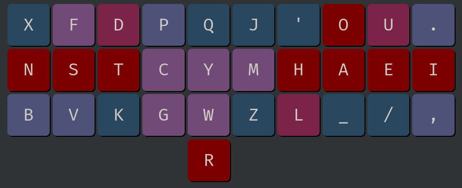

# Statistics

<!-- toc -->

## Heatmap


## Oxeylyzer
- No thumb key support
- Highest finger speed is on right ring at 0.769


## Genkey
- No thumb key support
- Highest finger speed is on right index at 1.59


## Krillyzer
- Krillyzer is mainly used for analyzing SFS and SFBS distance
- SFS distance at 1.149
- SFB distance at 1.337


## Keysolve
- It only support right thumb key, so it needs to be mirrored.
- I mainly look at HSB, HSS, FSB, and FSS here.


## Cmini
```
dusk
  b f d p q  j ' o u .
  n s t c y  m h a e i
  z v k g w  x l _ / ,
          r                 

MONKEYRACER:
  Alt: 28.22%
  Rol: 47.95%   (In/Out: 20.92% | 27.02%)
  One:  1.75%   (In/Out:  0.74% |  1.02%)
  Rtl: 49.70%   (In/Out: 21.66% | 28.04%)
  Red:  3.32%   (Bad:     0.32%)

  SFB: 0.38%
  SFS: 3.77%    (Red/Alt: 1.07% | 2.70%)

  LH/RH: 46.90% | 53.10%
```

## a200
- Right thumb space setting


## Cyanophage
- Its finger usage doesn't include the thumb `R` or space.
- It was speculated that its SFS include space, so it is much lower than other tools.


## 2U SFS
- Cyanophage's tool is one of the only tools that show 2u SFS.

- If you alt `'ll`, the actually number is 0.10%.

- There is the hidden `P__G` (mostly `-ping` as in `hoping`) and `K__D` (`kind`), but they are not that common.


## Finger Usage
- `Dusk` is right-hand heavy.

- If you are of the belief that thumb shouldn't count, then its `L:R = 38.81:54.76 = 41.48:58.52`, which is about as imbalanced as `Canary-ortho` at `42.24:57.76`.

- If you are of the belief that thumb should count, then it is even worse than `41.48:58.52` because space is by far the most common letter (more than `E`).
```
dusk (usage)
  b f d p q  j ' o u .
  n s t c y  m h a e i
  z v k g w  x l _ / ,
          r                 

MONKEYRACER:
  LI: 10.21%    RI: 13.35%
  LM: 12.02%    RM: 15.25%
  LR:  8.05%    RR: 16.58%
  LP:  8.53%    RP:  9.58%

  LT: 6.44%

  Total: 100.00%
```
## SFS Finger Distribution (Cmini)
- The total 3.98% is actually a more accurate number than the Cmini stat above due to some lower/upper case conversion issues in Cmini.

- No finger gets over 1%.

- Right index taking the most load at 0.98%, but it really only handles `HLM` as the other 3 keys are low frequency.
```
dusk (sfs)
  b f d p q  j ' o u .
  n s t c y  m h a e i
  z v k g w  x l _ / ,
          r                 

MONKEYRACER:
  LI:  0.63%    RI:  0.98%
  LM:  0.45%    RM:  0.54%
  LR:  0.25%    RR:  0.64%
  LP:  0.13%    RP:  0.37%

  LT: 0.00%

Total: 3.98%
```
## SFB Finger Distribution (Cmini)
- The total 0.48% is actually a more accurate number than the Cmini stat above due to some lower/upper case conversion issues in Cmini.

- No finger gets over 0.20%

- The majority of SFB for right index is attributed by `'m`, which is designed to be alted (`'l` too).
```
dusk (sfb)
  b f d p q  j ' o u .
  n s t c y  m h a e i
  z v k g w  x l _ / ,
          r                 

MONKEYRACER:
  LI:  0.09%    RI:  0.16%
  LM:  0.01%    RM:  0.07%
  LR:  0.02%    RR:  0.13%
  LP:  0.01%    RP:  0.00%

Total: 0.48%
```
