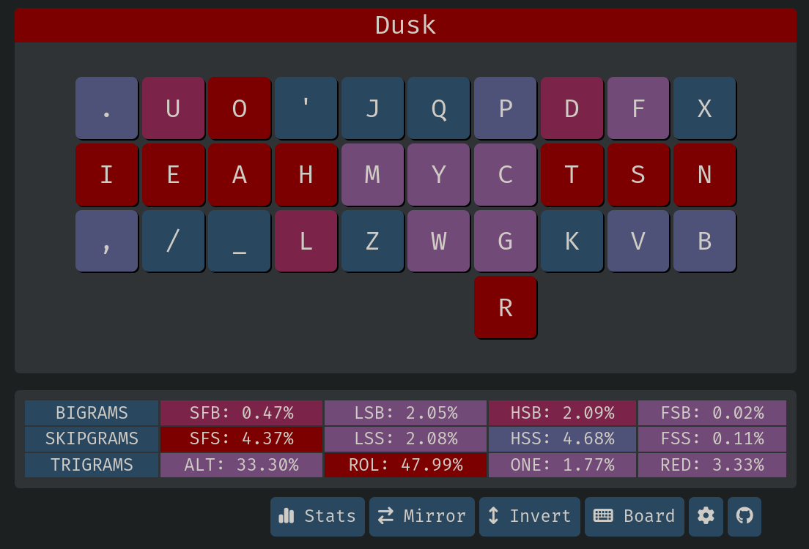

# Statistics

<!-- toc -->

## Heatmap


## Oxeylyzer
`main` branch at [this commit](https://github.com/O-X-E-Y/oxeylyzer/commit/192e2e38a2ec0e9a13c7ff11f0bf00b65bf1105b) with default settings and keyboard type set to `colstag`.

| Metric                          | Dusk           |
|---------------------------------|----------------|
| Highest finger speed            | 2.774 (RP)     |
| Pinky-Ring Bigramn              | 1.768%         |

```
dusk
x f d p q  j ' o u . 
n s t c y  m h a e i 
b v k g w  z l ; / , 
Sfb:  0.525%
Dsfb: 4.911%
Finger Speed: 17.338
    [1.639, 1.451, 2.028, 2.630, 2.321, 1.890, 2.636, 2.744]
Scissors: 0.311%
Lsbs: 2.175%
Pinky Ring Bigrams: 1.768%

Inrolls: 19.922%
Outrolls: 19.897%
Total Rolls: 39.820%
Onehands: 1.250%

Alternates: 20.976%
Alternates (sfs): 5.151%
Total Alternates: 26.127%

Redirects: 2.652%
Redirects Sfs: 1.492%
Bad Redirects: 0.277%
Bad Redirects Sfs: 0.111%
Total Redirects: 4.531%

Bad Sfbs: 0.332%
Sft: 0.010%

Score: -1.491
```

## Genkey

| Metric                          | Dusk           |
|---------------------------------|----------------|
| Highest finger speed            | 1.55 (RI)      |
```
dusk
x f d p q  j ' o u . 
n s t c y  m h a e i 
b v k g w  z l ; / , 
Missing characters: [r]
Rolls (l): 18.62%
	Inward: 14.71%
	Outward: 3.91%
Rolls (r): 31.79%
	Inward: 10.62%
	Outward: 21.16%
Alternates: 33.26%
Onehands: 1.59%
Redirects: 5.81%
Finger Speed (weighted): [0.74 0.55 0.73 1.39 1.55 0.88 1.28 1.16]
Finger Speed (unweighted): [1.10 1.98 3.50 7.62 8.53 4.22 4.61 1.74]
Highest Speed (weighted): 1.55 (RI)
Highest Speed (unweighted): 8.53 (RI)
Index Usage: 11.8% 12.6%
SFBs: 0.496%
DSFBs: 4.875%
LSBs: 1.92%
Top SFBs:
	ue 0.129%	oa 0.075%	cy 0.032%	lm 0.025%
	'm 0.024%	gy 0.023%	yp 0.022%	eu 0.020%

Worst Bigrams:
	ue 17.029	oa 11.602	ml 8.754	.i 7.824
	i, 7.077	nb 6.907	dt 6.037	py 3.978

Score: 27.00
```

## Krillyzer
Krillyzer is mainly used for analyzing SFS and SFBS distance

| Metric                          | Dusk           |
|---------------------------------|----------------|
| SFS distance                    | 1.151          |
| SFB distance                    | 1.335          |

```
Dusk
  x f d p q j ' o u .
  n s t c y m h a e i
  b v k g w z l _ / ,
  r

SFB              SFS              LSB             
  Freq  0.486%     Freq  4.920%     Freq  1.141%     
  Dist  1.335      Dist  1.151      Dist  2.081      

Rolls 48.945%
  Inroll   20.874%
  Outroll  28.071%

Trigrams
  Alternates 33.083%
  Redirects   4.878%
  Onehands    1.730%

Rows
  Top    20.496%
  Home   54.367%
  Bottom 10.982%
  Center  7.734%

Index        Middle       Ring         Pinky       
  L 10.61%     L 13.42%     L  8.74%     L  8.22%     
  R 12.78%     R 15.12%     R 15.04%     R  9.65%     

Hand Balance
  Left   41.003%
  Right  52.576%
  Thumb   5.137%
```

## Keysolve
It only support right thumb key, so it needs to be mirrored.

| Metric                          | Dusk           |
|---------------------------------|----------------|
| Half Scissor Bigrams            | 2.09%          |
| Half Scissor Skipgrams          | 4.68%          |
| Full Scissor Bigrams            | 0.02%          |
| Full Scissor Skipgrams          | 0.11%          |



## Cmini
```
dusk
  x f d p q  j ' o u .
  n s t c y  m h a e i
  b v k g w  z l _ / ,
          r                 

MONKEYRACER:
  Alt: 28.95%
  Rol: 49.90%   (In/Out: 21.69% | 28.20%)
  One:  1.80%   (In/Out:  0.76% |  1.04%)
  Rtl: 51.69%   (In/Out: 22.46% | 29.24%)
  Red:  3.38%   (Bad:     0.32%)

  SFB: 0.48%
  SFS: 3.89%    (Red/Alt: 1.14% | 2.76%)

  LH/RH: 46.97% | 53.03%
```

## a200
- Right thumb space setting

```
MONKEYTYPE-QUOTES.JSON
thumb: RT             

Dusk
x f d w q  j ' o u . 
n s t c y  m h a e i 
b v k g p  z l _ / , 

Trigrams
========
Alternates - Total: 33.07%   
     Rolls - Total: 43.74%   In: 21.88%   Out: 21.86%   Ratio:   1.00  
  Onehands - Total:  3.55%   In:  0.70%   Out:  2.85%   Ratio:   0.25  
 Redirects - Total:  7.40%   
   Unknown - Total:  0.00%   

Same Finger
===========
       SFB - 1.68%         DSFB - 4.17%   
       SFT - 0.02%          SFR - 6.37%   

Finger Use
==========
      Left - Total: 38.07%   LP:  6.84%   LR:  7.20%   LM: 11.09%   LI: 12.95%   
     Right - Total: 43.42%   RP:  8.07%   RR: 12.35%   RM: 12.47%   RI: 10.54%   
     Thumb - Total: 18.50%   

Row Use
=======
       Top - 23.02%         Home - 63.61%       Bottom - 13.37%
```
## Cyanophage
This website gets mentioned a lot lately and for a good reason - it is one of the most accessible playground for keyboard layouts creations that exist as of April 2024, but a few things to keep in mind:
- Its finger usage doesn't include the thumb `R` or space.
- It was speculated that all its stats include space, so they are all much lower than those from the other tools.

### Regarding Scissors
I am not on board with how Cyanophage calculates scissors; for examples, `zo` and `vp` on dusk are not considered as scissors, but `lo` is, and there is no consideration for half scissors like `pt` or `ft` at all. Additionally, Cyanophage considers `nf` and `e,` to be scissors, but they are not normally considered to be scissors.


## 2U SFS
- Cyanophage's tool is one of the only tools that show 2u SFS.

- If you alt `'ll`, the actually number is 0.10%.

- There is the hidden `P__G` (mostly `-ping` as in `hoping`) and `K__D` (`kind`), but they are not that common.


## Finger Usage
- `Dusk` is right-hand heavy.

- If you are of the belief that thumb shouldn't count, then its `L:R = 38.86:54.71 = 41.53:58.47`, which is about as imbalanced as `Canary-ortho` at `42.24:57.76`.

- If you are of the belief that thumb should count, then it is even worse than `41.53:58.47` because space is by far the most common letter (more than `E`).
```
dusk (usage)
  x f d p q  j ' o u .
  n s t c y  m h a e i
  b v k g w  z l _ / ,
          r                 

MONKEYRACER:
  LI: 10.21%    RI: 13.30%
  LM: 12.02%    RM: 15.25%
  LR:  8.05%    RR: 16.58%
  LP:  8.58%    RP:  9.58%

  LT: 6.44%

  Total: 100.00%
```
## SFS Finger Distribution (Cmini)
- Right index taking the most load at 0.97%, but it really only handles `HLM` as the other 3 keys are infrequent.
```
dusk (sfs)
  x f d p q  j ' o u .
  n s t c y  m h a e i
  b v k g w  z l _ / ,
          r                 

MONKEYRACER:
  LI:  0.63%    RI:  0.97%
  LM:  0.45%    RM:  0.54%
  LR:  0.25%    RR:  0.64%
  LP:  0.13%    RP:  0.37%

  LT: 0.00%

  Total: 3.97%
```
## SFB Finger Distribution (Cmini)
- No finger gets over 0.20%

- The majority of SFB for right index is attributed by `'m`, which is designed to be alted (`'l` too).
```
dusk (sfb)
  x f d p q  j ' o u .
  n s t c y  m h a e i
  b v k g w  z l _ / ,
          r                 

MONKEYRACER:
  LI:  0.09%    RI:  0.16%
  LM:  0.01%    RM:  0.07%
  LR:  0.02%    RR:  0.13%
  LP:  0.01%    RP:  0.00%

  Total: 0.48%
```
