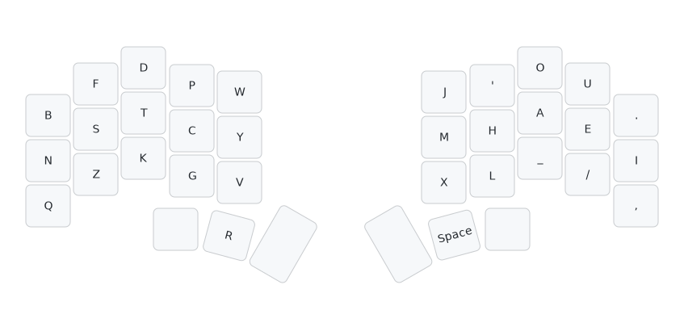

# Layout
<!-- toc -->
## Dusk
- On my keyboard Piantor, `R` is slightly to the right of what's shown here.


### ACSII
```
b f d p q  j ' o u .
n s t c y  m h a e i
z v k g w  x l _ / ,
        r   
```

## Dusk-qvz
It's made to address concern over `V`.

This variant has similar stats but with even lower scissor at the expense of having left index do more work and higher 2u SFS from `g_v`.

- The higher 2u SFS can further be addressed by swapping `PG`, but `NG` and `G_T` become slightly worse.

- Or you can swap `WV`, but make sure you are okay with typing `know`.



### ACSII
```
b f d p v  j ' o u .
n s t c y  m h a e i
q z k g w  x l _ / ,
        r                  
```
