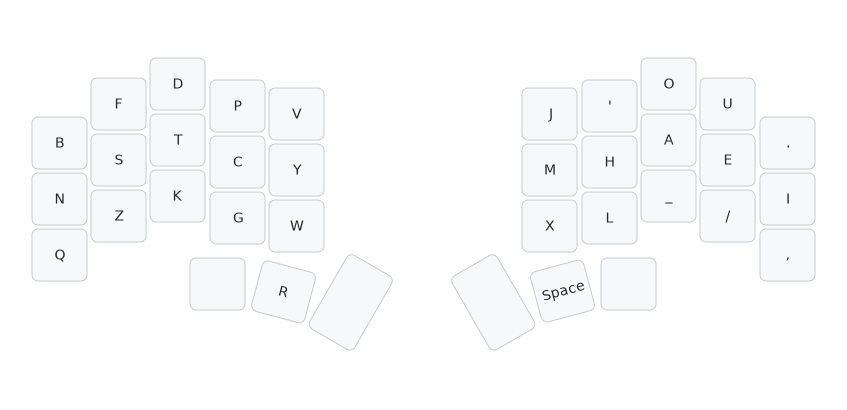

# Layout
- On my keyboard Piantor, `R` is slightly to the right of what's shown here.


## ACSII
```
b f d p q  j ' o u .
n s t c y  m h a e i
z v k g w  x l _ / ,
        r   
```

# Variant
It's made to address conern over `V`.

This variant has similar stats but with even lower scissor at the expense of having left index do more work.
## Dusk-qvwz



## ACSII
```
b f d p w  j ' o u .
n s t c y  m h a e i
q z k g v  x l _ / ,
        r                  
```
